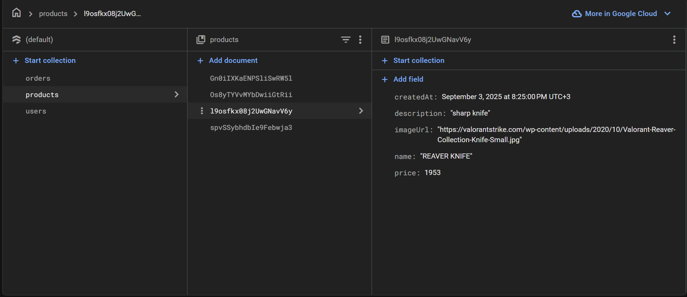

# 🌙 Night Market

**Night Market** is a demo e-commerce app built with **Flutter** and **Firebase**.  
The app allows users to browse products, sign in or sign up with email & password, and add items to their cart.  
Only the **owner** can upload new products, while regular users can view and purchase.

---

## 🚀 Features
- 🔑 **Firebase Authentication** (Email/Password)  
- 📦 **Product catalog** (publicly visible to all users)  
- 🛒 **Cart management**  
- 👤 **Role-based access**  
  - **Owner** → can upload/manage products  
  - **Users** → can view and purchase products  
- ☁️ **Firestore rules** implemented for secure access  
- 📱 Cross-platform (Android & iOS)

---

## 📸 Screenshots

### 🔐 Authentication


### 🏠 Home / Products


### 🛒 orders


### 🔒 Firebase Rules Example


---

## 🎥 Demo Video


---

## 🛠️ Tech Stack
- **Flutter** (Dart)  
- **Firebase Authentication**  
- **Cloud Firestore**  
- **Provider / State Management** (or whichever you used)  

---

## 🔑 Firebase Setup


To set up Firebase for your own build:
1. Create a new project in [Firebase Console](https://console.firebase.google.com/).  
2. Enable **Email/Password Authentication**.  
3. Create a **Firestore Database** with your collections (see rules screenshot).  
4. Connect your Flutter app to Firebase
5. Place these files in your local project.  
6. Run the app:
   ```bash
   flutter pub get
   flutter run
## ⚡ Getting Started
Clone the repo and run locally:
```bash
  git clone https://github.com/mrxyz606/night-market.git
  cd night-market
  flutter pub get
  flutter run

```

## ✨ Author
👩‍💻 Developed by **Malak Mansour**  
📧 Contact: [mansormalak606@gmail.com](mailto:mansormalak606@gmail.com)  
🔗 GitHub: [mrxyz606](https://github.com/mrxyz606)  
